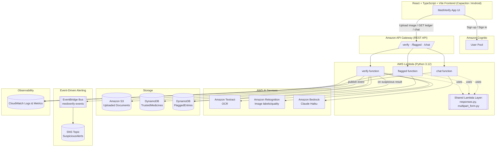
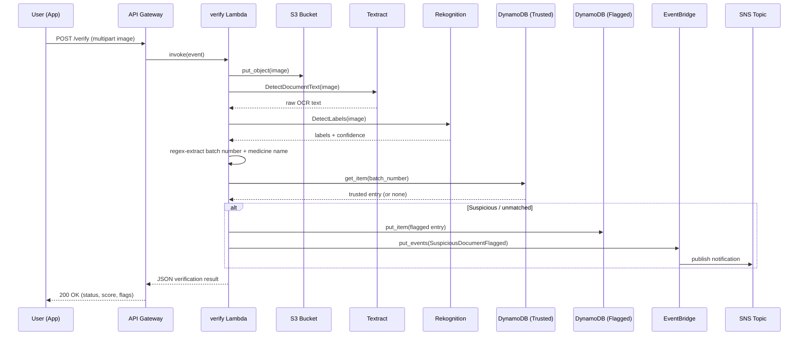

# MediVerify AI — AWS Architecture

## System Diagram

## Data Flow — Document Verification (`POST /verify`)

## Why Each Service Was Chosen

| Service | Role | Rationale |
|---|---|---|
| **API Gateway** | Public HTTPS entrypoint | Managed, scales automatically, pairs naturally with Lambda; keeps the exact same `/verify`, `/flagged` contract the frontend already expects, plus new `/chat` |
| **Lambda** | Compute for all 3 routes | No servers to patch/manage — ideal for a time-boxed hackathon prototype; scales to zero between demos |
| **Amazon Textract** | OCR | Purpose-built for document text extraction; far more reliable than a local Tesseract binary dependency, and removes an OS-level dependency from the deployment entirely |
| **Amazon Rekognition** | Image signal | Adds a real (if lightweight) image-quality signal into the authenticity score, replacing a portion of the previous fully-random score |
| **DynamoDB** | Trusted ledger + audit log | Serverless, single-digit-millisecond lookups by `batch_number`; replaces two local JSON files with a durable, queryable store |
| **S3** | Uploaded document storage | Durable audit trail of every submitted image, referenced by key in verification results |
| **Cognito** | Authentication | Real user pool with email verification, replacing the localStorage-only mock login while keeping the same screens |
| **Bedrock** | Chat assistant | Powers the existing "Security Response Desk" panel with a real LLM (Claude Haiku) instead of hardcoded string matching |
| **EventBridge + SNS** | Suspicious-document alerting | Demonstrates event-driven architecture: a flagged scan fires an event that fans out to a notification topic, decoupled from the verify Lambda's request/response cycle |
| **CloudWatch** | Logs & metrics | Automatic per-Lambda log groups (1-week retention) plus API Gateway execution metrics, no extra code required |

**Comprehend and SQS were intentionally not used** — there's no unstructured-text-classification need beyond the existing regex/Textract pipeline, and the request volume/pattern doesn't call for a queue between synchronous API calls.
